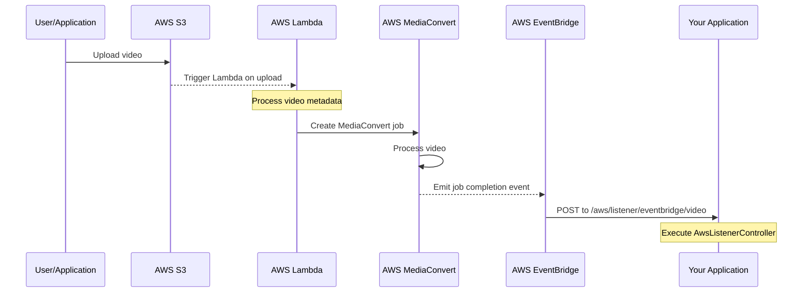

# AWS Video Processing System Documentation

## Overview
This documentation covers a Symfony-based video processing system that integrates with AWS MediaConvert and EventBridge. The system handles video processing notifications and updates the application's database accordingly.

## System Architecture

### Components
1. AWS S3: Stores uploaded videos
2. AWS Lambda: Triggers MediaConvert jobs
3. AWS MediaConvert: Processes videos
4. AWS EventBridge: Handles event notifications
5. Symfony Application: Processes notifications and updates database

### Flow Diagram


## Controller Implementation

### AwsListenerController
Main controller handling AWS EventBridge notifications:

```php
namespace App\Controller;

class AwsListenerController extends AbstractController
{
    #[Route('/aws/listener/eventbridge/video', name: 'aws_listener.eventbridge.video', methods: ['POST'])]
    public function index(): Response
    {
        // Implementation details...
    }
}
```

Key Features:
- Processes AWS EventBridge notifications
- Creates ProcessedVideo records
- Updates Post records
- Sends Slack notifications
- Returns JSON response

### Security Note
⚠️ Current implementation lacks authentication. This should be addressed before production deployment.

## AWS Lambda Function

The Lambda function handles video processing initiation:

```python
import boto3
import json

def lambda_handler(event, context):
    # Get S3 event details
    bucket = event['Records'][0]['s3']['bucket']['name']
    key = event['Records'][0]['s3']['object']['key']
    
    # Initialize MediaConvert client
    mediaconvert = boto3.client('mediaconvert', 
        endpoint_url='YOUR_MEDIACONVERT_ENDPOINT')
    
    # Job settings implementation...
    
    # Create the transcoding job
    response = mediaconvert.create_job(**job_settings)
    
    return {
        'statusCode': 200,
        'jobId': response['Job']['Id']
    }
```

## AWS EventBridge Setup

### Creating EventBridge Rule

1. Via AWS Console:
```yaml
Login to AWS Console -> EventBridge -> Create rule
Rule Name: MediaConvertJobComplete
Description: Triggers when MediaConvert job completes
Event Pattern: Rule with an event pattern
```

2. Event Pattern:
```json
{
    "source": ["aws.mediaconvert"],
    "detail-type": ["MediaConvert Job State Change"],
    "detail": {
        "status": ["COMPLETE"]
    }
}
```

3. Via AWS CLI:
```bash
aws events put-rule \
    --name "MediaConvertJobComplete" \
    --description "MediaConvert job completion events" \
    --event-pattern "{\"source\":[\"aws.mediaconvert\"],\"detail-type\":[\"MediaConvert Job State Change\"],\"detail\":{\"status\":[\"COMPLETE\"]}}"
```

### Setting up API Destination

```bash
# Create connection
aws events create-connection \
    --name "APIConnection" \
    --authorization-type "API_KEY" \
    --auth-parameters '{"ApiKeyAuthParameters":{"ApiKeyName":"x-api-key","ApiKeyValue":"your-api-key"}}'

# Create API destination
aws events create-api-destination \
    --name "YourAPIDestination" \
    --connection-arn "arn:aws:events:region:account-id:connection/connection-name" \
    --invocation-endpoint "https://your-domain/aws/listener/eventbridge/video" \
    --http-method "POST"
```

## Testing

### Testing the API Endpoint

1. Using cURL:
```bash
curl -X POST http://your-domain/aws/listener/eventbridge/video \
-H "Content-Type: application/json" \
-d '{
  "detail": {
    "status": "COMPLETE",
    "outputGroupDetails": [{
      "outputDetails": [{
        "outputFilePaths": ["/path/to/video.mp4"]
      }]
    }],
    "queue": "MyQueue",
    "timestamp": "2024-03-14T12:00:00",
    "jobId": "123456"
  }
}'
```

2. Using AWS CLI:
```bash
aws events put-events --entries file://test-event.json
```

### Testing EventBridge Rule

Create test-event.json:
```json
{
  "Entries": [
    {
      "Source": "aws.mediaconvert",
      "DetailType": "MediaConvert Job State Change",
      "Detail": "{\"status\":\"COMPLETE\",\"outputGroupDetails\":[{\"outputDetails\":[{\"outputFilePaths\":[\"/path/to/video.mp4\"]}]}]}",
      "EventBusName": "default"
    }
  ]
}
```

## Required IAM Permissions

```json
{
    "Version": "2012-10-17",
    "Statement": [
        {
            "Effect": "Allow",
            "Action": [
                "events:PutRule",
                "events:PutTargets",
                "events:DescribeRule",
                "events:DeleteRule",
                "events:RemoveTargets",
                "s3:GetObject",
                "s3:PutObject",
                "mediaconvert:CreateJob",
                "mediaconvert:GetJob",
                "mediaconvert:ListJobs"
            ],
            "Resource": [
                "arn:aws:events:*:*:rule/*",
                "arn:aws:s3:::your-input-bucket/*",
                "arn:aws:s3:::your-output-bucket/*",
                "arn:aws:mediaconvert:*:*:*"
            ]
        }
    ]
}
```

## Best Practices

1. Security
   - Implement proper authentication for the API endpoint
   - Use environment variables for sensitive values
   - Regularly rotate API keys

2. Monitoring
   - Set up CloudWatch alarms for failed events
   - Monitor EventBridge metrics
   - Implement proper error logging

3. Error Handling
   - Implement retry policies for failed deliveries
   - Use dead-letter queues for failed events
   - Add proper exception handling in the controller

## Future Improvements

1. Add authentication to the API endpoint
2. Implement proper error handling and logging
3. Move Slack webhook URL to environment variables
4. Add request validation
5. Implement proper HTTP status codes
6. Add database transactions
7. Consider async processing for notifications

## Contributing
Please read CONTRIBUTING.md for details on our code of conduct and the process for submitting pull requests.

## License
This project is licensed under the MIT License - see the LICENSE.md file for details
